# PhiCreator v0.1.2 doc #
**注：所有数字输入框不能直接输入小数点，需要在别的地方输入好后复制粘贴上去（啥b bug快修）**
**还有，在一个正整数前面用英文输入法输入.可以直接创造0.x**
## 1.编辑器选项 ##
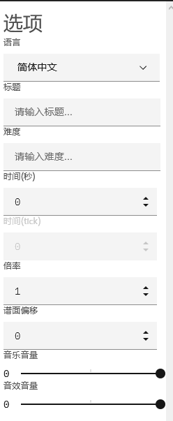  
1.语言  
只有英文和中文，大家凑活着用（关键是这个中文还不是完全汉化）  
2.标题  
字面意思，里面填字符串，就是曲名  
3.难度  
这个也是字符串，如果是IN铺面难度15那么输入IN Lv.15而不是15  
格式是EZ/HD/IN/AT/SP LV.x（x为正整数，除了SP跟的是LV.?）  
对了，这是官谱格式不一定要遵守，但是尊重传统最好还是用它（  
4.时间（秒）  
这个一般不动，除了初始化需要手动输入之外一般不用特别调 
5.时间（tick）  
注：不可编辑  
以tick为单位的时间，一拍=72tick（详情参见[PhiFormat文档](https://phi-x.github.io/PhiFormat/ "PhiFormat文档")）  
一拍是以拍号决定的，拍号a/b意思是每小节a拍，以b分音符为一拍（a，b都是正整数）  
6.倍率  
可以输入小数，但是bug参照注释（  
这个是歌曲的预览速度（，同时会改变谱面速度  
7.谱面偏移  
<del>字面意思</del>正数音乐晚放多久负数谱面晚放多久，可以用小数bug还是参照注释，单位tick  
8.音乐音量  
滚动条，字面意思（  
9.音效音量  
> 滚动条，字面意思（  

## 2.谱面预览 ##
1.音乐预览  
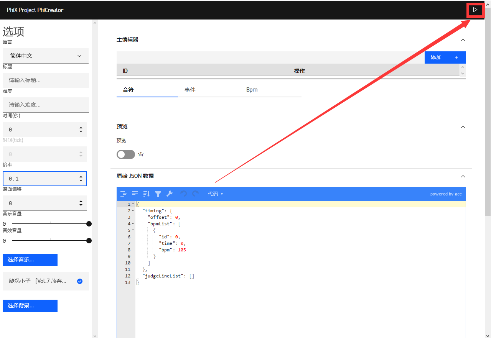  
2.谱面预览  
选中音符/事件/Bpm时会出现的预览  
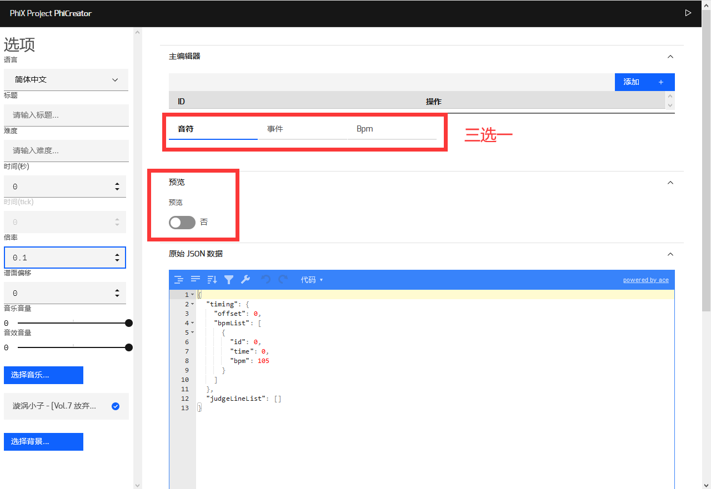  
点击第二个红框里的（我忘记名字了反正就否字左边的那个玩意儿）即可开启谱面预览  
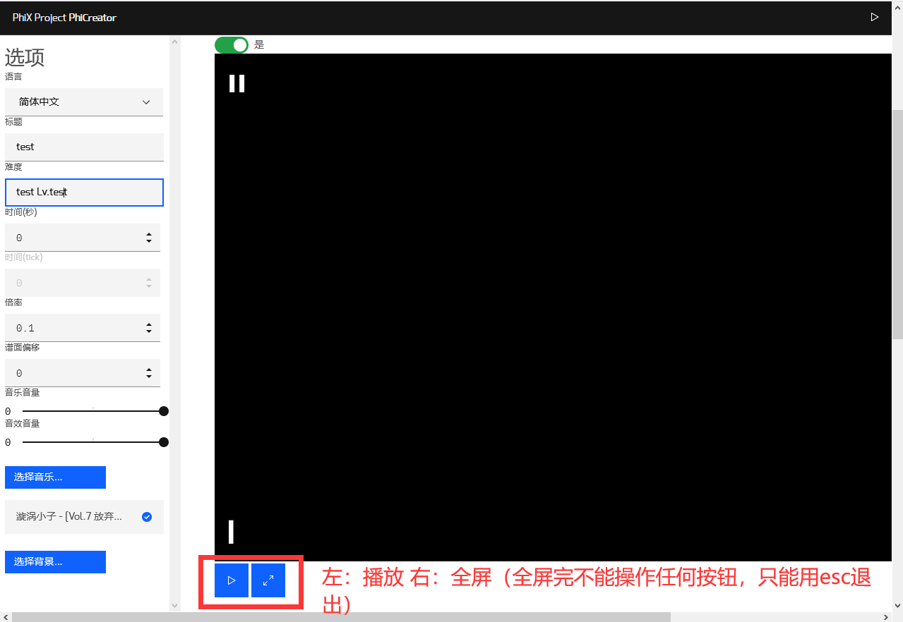  

##3.编辑器##
<del>（出现了，重头戏）</del>  
首先，<del>硬核</del>编辑法  
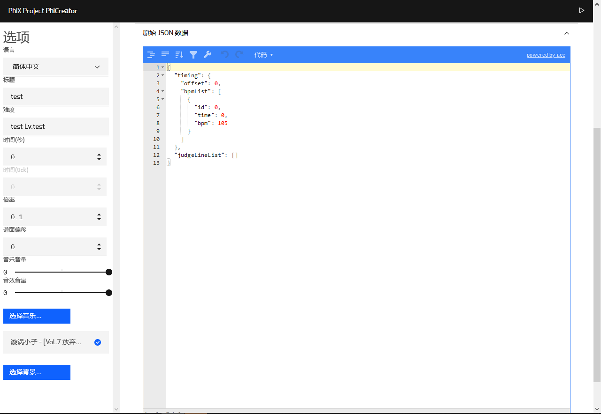
最右边那个滚动条拉到最下面有个原始JSON数据，可以根据[PhiFormat文档](https://phi-x.github.io/PhiFormat/ "PhiFormat文档")硬艹（  
其次，软核编辑法  
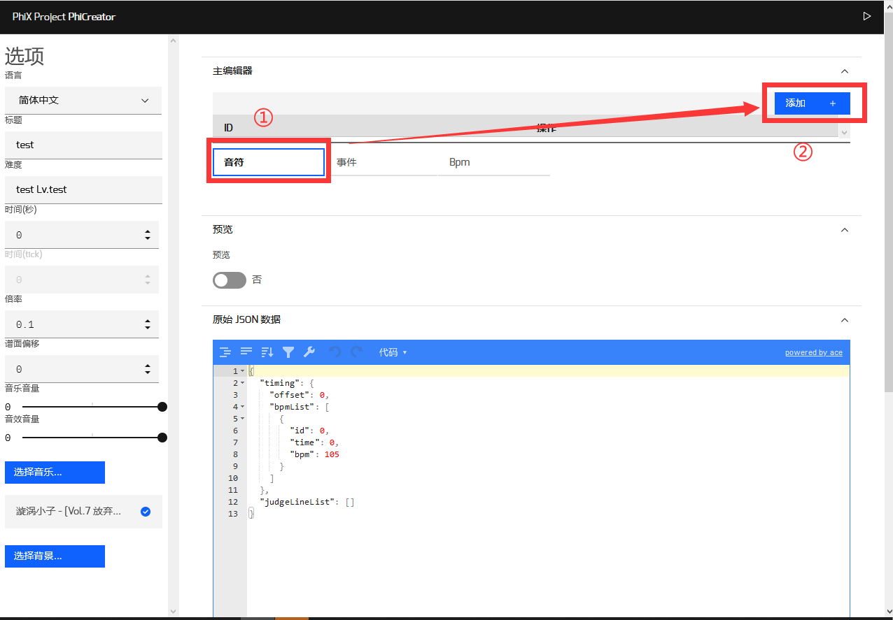
点一下红框1里面的“音符”选项卡，再点击添加（其实选项卡和添加的点击顺序反过来也行），会自动添加construct属性判定线（判定线属性后面会讲）  
然后，会变成这样  
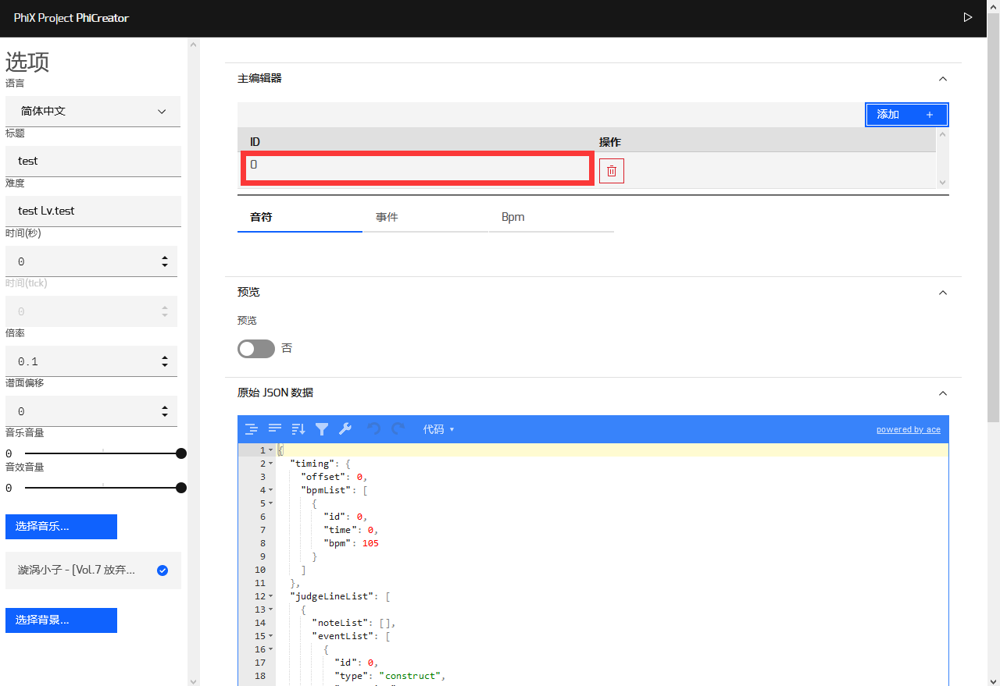  
点一下红框范围内的东西（就是选中它），会跳出一个模块  
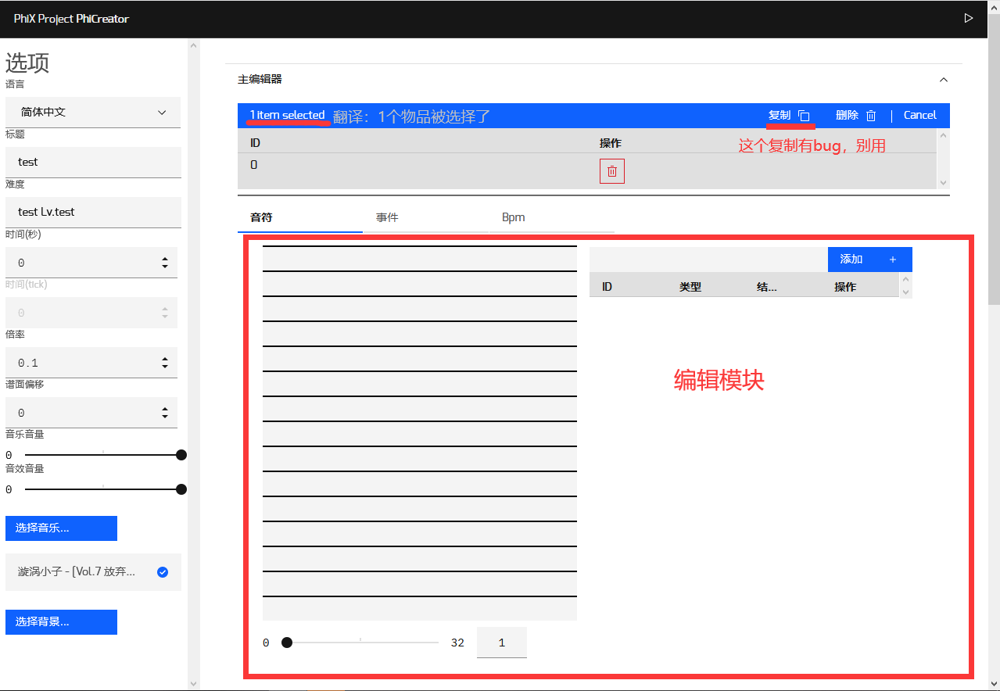  
转移视线至编辑模块  
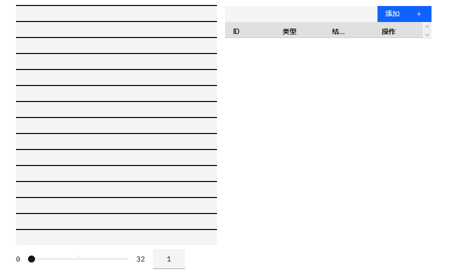  
下面那个滚动条是缩放（注意右边的数字不能为0，否则会有bug（指滚轮没用），右边数字可以手动输入小数）  
滚动条上面一堆黑线和灰色背景的地方是note时值预览，可以对时值（  
添加note方法在右边那一块  
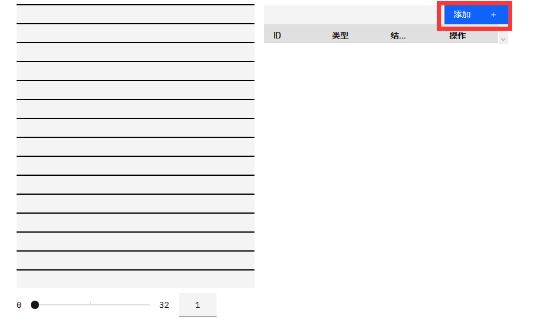  
点击红框里的按钮，默认添加一个类型为click，结束时间为0的note  
这里是note种类
click就是一个蓝键  
drag就是一个黄键  
flick就是一个红键（或者叫粉键）  
hold就是一个长条（俗称面条）  
选中那个note（和上面那个一样方法）  
会跳出这玩意儿
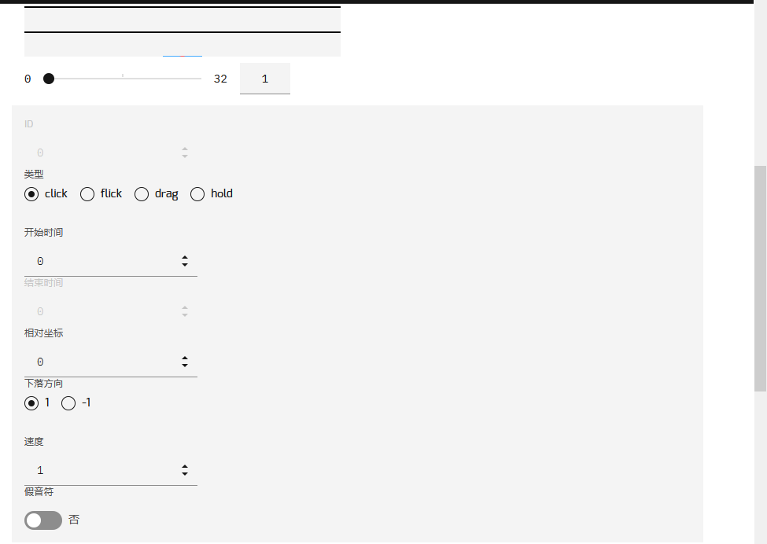  
(不想写了有人接力吗）